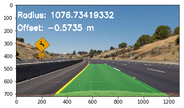

# Advanced Lane Finding Project

The goals / steps of this project are the following:

* Compute the camera calibration matrix and distortion coefficients given a set of chessboard images
* Apply a distortion correction to raw images
* Use color transforms, gradients, etc., to create a thresholded binary image
* Apply a perspective transform to rectify binary image ("birds-eye view")
* Detect lane pixels and fit to find the lane boundary
* Determine the curvature of the lane and vehicle position with respect to center
* Warp the detected lane boundaries back onto the original image
* Output visual display of the lane boundaries and numerical estimation of lane curvature and vehicle position

---

## Camera Calibration

### Introduction

Image distortion occurs when a camera looks at 3D objects in the real world and transforms them into a 2D image. This transformation isn’t perfect. More information can be found here: https://en.wikipedia.org/wiki/Distortion_(optics)

Before using a camera image, we must undo this distortion so that the information we infer from it is accurate. To correct for the distortion unique to a given camera lense, we can take pictures of images whose 2D shapes are known and calculate the difference. This difference is the correction factor, which can be applied to all subsequence camera images to undistort them.

### Chessboard images

A known 2D shape is a chessboard. If we take multiple pictures of this shape, with varying angles, distances, and with different parts of the lense, we will capture the characteristics of our lense distortion.


### Camera matrix and distortion coefficients

The OpenCV library provides camera calibration functions that compute the camera matrix and distortion coefficients using corners detected in an array of chessboad images. These functions are wrapped up in a class called `CameraCorrection`.

```python
cc = CameraCorrection()
cc.find_corners(glob.glob('./camera_cal/calibration*.jpg'))
cc.calibrate_camera()
```

The first function `find_corners()` iterates through each image and returns a list of found corners using `cv2.findChessboardCorners()`. The second function `calibrate_camera()` passes the found corners to `cv2.calibrateCamera()`. With each found set of corners the OpenCV function is also passed a set of fixed (x, y, z=0) coordinates that represent a 2D view of a chessboard as it is known. This function returns the matrix and coefficients that can then undistort any image.

### Distortion correction

Using OpenCV again, we can use the matrix and coefficients calculated in `calibrate_camera()` and undistort any image, using the `cv2.undistort()` function. As an example, we can see here one of the chessboard images being corrected.


---

## Thresholded binary images

### Introduction

To detect lane lines in an image, we could use a simple canny edge-detection algorithm to reduce our image to stark lines. However, with varying environmental conditions such as bright light, dark shadows, and different lane colours, we will need a more robust method. The following section highlights some methods used to improve the lane detection accuracy.

### Colour transforms

HSV (left) and HLS (right) colour spaces are commonly used in image analysis.


We can take advantage of isolating the channels from these colour spaces to provide a more consistent contrast between lane lines and everything else, from one frame to the next.

We will take the following RGB image as an example.


Then the same image, using the HLS (above) and HSV (below) colour spaces, is broken out into the constituent channels.


We can see from this image that the s (saturation) channel from HLS and the v (value) channel from HSV do good jobs of showing up the lane lines. Particularly, the v channel gives a good overall contrast, and the s channel does a good job of providing contrast for the white, dashed lane lines on the right of the image.

I go on to use these channels in my processing pipeline.

### Gradients and binary thresholds

We can get binary threshold images using the v and s channels to maximise the contrast between lane lines and the road surface. By selecting appropriate thresholds, above and below which the image is blacked out, we are left with only those pixel regions that lie within a region containing lane lines. The extra information present in some of these pictures (such as the trees) can be masked out later in the processing pipeline.

The following images were taken from the same example image in the previous section.

The following image shows from left to right: s_channel; v_channel; bitwise_and(s_channel, v_channel)


We can also use the Sobel operator to take the derivate of our image (used in the canny edge-detection algorithm), which produces an image that emphasises neighbouring pixels with a sharp contrast gradient. Applying the Sobel operator in the **x dimension** emphasises vertical gradients the most - useful for our lane lines.

The following image shows from left to right: sx_channel; vx_channel; bitwise_and(sx_channel, vx_channel)


Finally, by combining (bitwise OR) the two outputs from the previous binary thresholding operations, we produce a single binary output.


---

## Perspective transforms

### Introduction

A perspective transform maps a set of coordinates in an image to a different set of coordinates. For the purposes of lane detection, we want to transforming the perspective of the front-facing camera to a bird’s-eye view. This is useful for calculating the true curvature of the lane lines in an image.

### Source and destination coordinates

To transform the image, we need two sets of coordinates. We are interested in having a 2D-like, bird's-eye view of the lane where after transforming a straight lane, the lane lines appear parallel. Therefore, the first set of coordinates will take the shape of an isosceles trapezoid that bounds the straight lane lines in our front-facing camera.

Instead of finding these coordinates manually, we could use a binary image of straight lane lines, calculate the coefficients of a 1st degree polynomial that describes each lane line, and then take two points on each line as the source coordinates for our transform.

The class `ImageTransforms` (see image_transforms.py for implementation details) calculates the perspective transform source coordinates when instantiated by passing in an image of straight lane lines.

```python
image = cv2.imread('./test_images/straight_lines1.jpg')
transforms = ImageTransforms(image)
```

These images show this process. From left to right: Binary image of straight lane lines; Hough lines drawn on original image; Our 4 source coordinates (blue, orange, green and red dots)


The destination coordinates are set such that the new image forms parallel lane lines. The blue and red dots retain the same coordinates. The orange dot's x coordinate takes on the same value as the blue dot's x coordinate, and the y coordinate is given a value of zero. Likewise with the green dot, respecting the red dot's x coordinate.


### Applying perspective transform on curved lines

Now we have source and destination coordinates, any image of lane lines can be transformed to a bird's-eye view.

```python
image_straight = cv2.imread('./test_images/straight_lines1.jpg')
image_curved = cv2.imread('./test_images/test_lines1.jpg')
transforms = ImageTransforms(image_straight)
binary_curved = transforms.pipeline(image_curved, 'binary')
image_transformed = transforms.perspective_transform(binary_curved)
```


---

## Calculating lane curvature and vehicle position

Now we can use the bird's-eye view of the lane lines to measure the curvature of the lane.

A class called `LineTracking` (in line_tracked.py) is used to calculate lane curvature and vehicle position and to keep a record of previous frame data for using with a video stream.

We must search through the image and mark all points on the image we suspect form part of the lane lines. The first step is to take a histogram of the bottom half of the image to detect the best likely starting points for our search. Our search consists of iterating up through the image (decrementing the y coordinate) searching within a +/- margin of our x coordinate and marking any pixels with a values of 1 (indicating a white pixel forming part of a lane line). If the margin's central tendency moves off the mean, the window is nudged in that x direction and the search continues upwards.

Once done, a line of best bit is calculated using the marked pixels to describe a 2nd degree polynomial for our curved lane lines. The full implementation can be found in the function `sliding_window_start()`.


To measure curvature, we take the calculated polynomial and fit it to real world by scaling up from pixels to meters. The offset from centre lane can also be calculated. These calculations are performed in `measure_curvature()`.

The lane can be filled in using `cv2.fillPoly()` and warped back onto the original front-facing camera image using an inverse perspective transform. This can be performed using `warp_lanes_back()`.



---

## Video stream example


## Final thoughts

The hardest part was setting the threshold values to generate consistent binary images of the lane lines. I spent most of my time on this project getting the values right. I would explore colour spaces even more as I think this area is an important starting point.

I couldn't get an optimised sliding window to work. Given more time I would revisit this and try the convolution approach. I could also provide smoother lane detection by applying a low-pass filter to prevent spurious curvature values caused by difficult frames.
